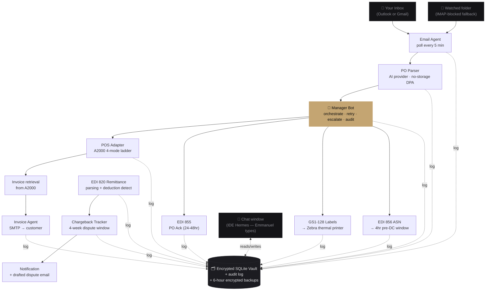
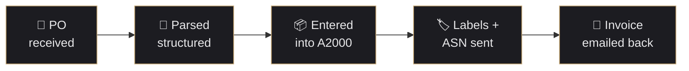
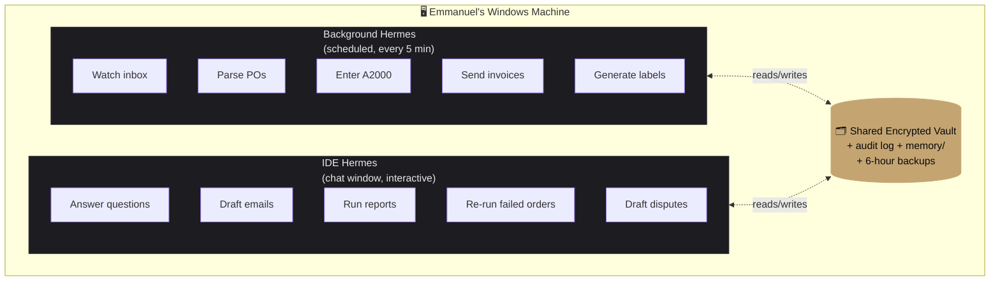

# Hermes — Demo Package

> Everything needed to show Hermes to Emmanuel. The visual is **public** so we can send him the link directly; the live proof-of-concept is what we walk him through on the call.

## The public link

The HTML walkthrough is published via GitHub Pages from `/docs`:

> **https://cc90210.github.io/hermes/**

Send this directly to Emmanuel. Renders on phone, tablet, and desktop. Self-contained — no JS, no build step, no broken images. Open in any browser, scroll top-to-bottom.

The same file lives at [`DEMO.html`](DEMO.html) for offline / in-person walkthroughs.

## Three deliverables

1. **[`DEMO.html`](DEMO.html)** — the public visual. One self-contained page. Tells the full story: problem → loop → demo storyboard → security (filing-cabinet metaphor) → value math → two paths to start → 30-day trial. Works offline. Prints clean to PDF for a leave-behind.

2. **The live proof-of-concept** — Adon's Gmail, authenticated through Google Console, with Hermes parsing real PO emails into a Google Sheet. This is what we built in the days leading up to the meeting and what we run during the call. It is the concrete proof Emmanuel can see in his own browser tab.

3. **The mock terminal run** — `demo\demo.bat` on Windows (or `python -m demo.run_demo`). Backup if the live Gmail demo hits a snag. Completes in ~0.1 seconds.

## How to show it

1. **Send Emmanuel the public link before the meeting.** Two days out. "Take ten minutes to scroll this — we'll walk through the live version on the call."
2. **On the call:** screenshare the Gmail inbox. Drop a sample PO in. Show it land in the Google Sheet. Narrate the parse.
3. **Then walk DEMO.html** top-to-bottom — ~8 minutes if no questions, ~15 if he engages (good sign).
4. **Hold demo.bat in reserve** — only run if the live demo hiccups or he asks "show me the actual terminal."

## What Changed Since the Last Version

Both the public site and the trial agreement reflect the partner meeting from 2026-04-27:

- **Trial length: 14 → 30 days.** An agent needs four weeks to learn a business, not two.
- **No price talk in the meeting.** Pricing is a day-30 conversation backed by real audit data.
- **Security reframe:** filing-cabinet metaphor, two-key encryption, encrypted backups every 6 hours, AI providers under SOC 2 + DPA contracts. Cloud is fine — *unaccountable storage* is the risk, and we don't use that.
- **Demo storyboard added:** the Gmail → Google Sheet proof-of-concept is the headline visual. It's what Emmanuel will actually see in his browser.
- **Two-paths section added:** Easy Start (cloud-backed, ready in 30 min, recommended) vs. Local-Only (offline AI, optional upgrade later, requires hardware). Lowest barrier to entry first.
- **Lowest-barrier-to-entry path called out:** uses the ChatGPT subscription Emmanuel already pays for. No new tools, no new bills.

## Architecture diagram (Mermaid)

For markdown viewers (GitHub, Obsidian, Cursor) that render Mermaid natively.

## The 5-step pipeline (simplified flow)

## Two-layer deployment

## Demo narration script (cheat card)

See the full meeting plan at [`MEETING_PLAN.md`](MEETING_PLAN.md) — this is the condensed version to hold in hand during the walkthrough.

| Section in DEMO.html | 30-second line |
|---|---|
| **Hero** | "Built for Lowinger Distribution specifically. Thirty days free. No credit card. Live in the meeting." |
| **The problem (6:42 AM timeline)** | "This is the day we're taking off your plate. Every line here is a handoff Hermes takes." |
| **The loop (5 steps)** | "Email in. AI parses it. Order into A2000. Labels print, ASN goes out. Invoice back. All automatic." |
| **What you'll see in the demo** | "We're showing the loop on Adon's real Gmail right now — parsing a PO into a Google Sheet you can refresh in front of you. Same path goes to your A2000." |
| **How you talk to him** | "You type. Like texting a sharp new hire. Uses the ChatGPT subscription you already pay for." |
| **Why your data stays yours** | "Digital filing cabinet. Military-grade encryption. Backed up every six hours. AI provider has a contract that says no copies allowed." |
| **Value math** | "$50–150K in chargebacks — that's the floor, not the ceiling. Time savings is bonus." |
| **Two ways to start** | "Easy Start uses your existing setup, ready in thirty minutes. Local-only is an upgrade you can do later if you ever want it. Most clients never do." |
| **What's in the box** | "Right column is the control you keep. He drafts, you approve. Put on your plate, not take off it." |
| **Path forward** | "Thirty days free. No credit card. No price conversation until day thirty. We sit down with the audit logs and decide together." |

## File pointers

- [`DEMO.html`](DEMO.html) — the visual package (also published at https://cc90210.github.io/hermes/)
- [`SECURITY.md`](SECURITY.md) — filing-cabinet security overview, plain-English
- [`TRIAL_TERMS.md`](TRIAL_TERMS.md) — 30-day free trial agreement, ready to send
- [`MEETING_PLAN.md`](MEETING_PLAN.md) — full meeting script + agenda + objection handling
- [`BUILD_PLAN.md`](BUILD_PLAN.md) — phase-by-phase roadmap (show if he asks "how soon can this go live")
- [`DISCOVERY_QUESTIONS.md`](DISCOVERY_QUESTIONS.md) — the questions to send after the meeting
- [`WHOLESALE_RESEARCH.md`](WHOLESALE_RESEARCH.md) — backup citations for the chargeback math if pushed
