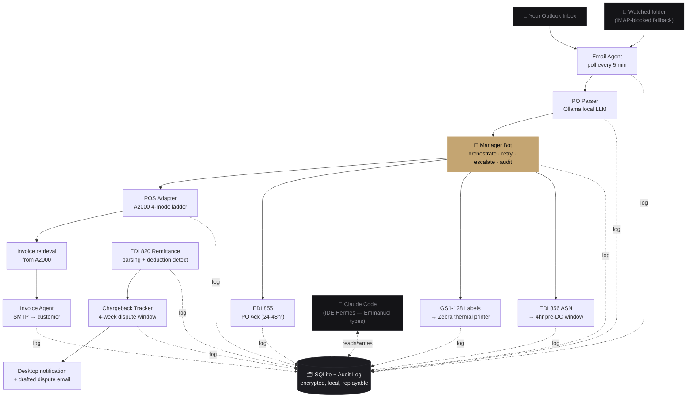
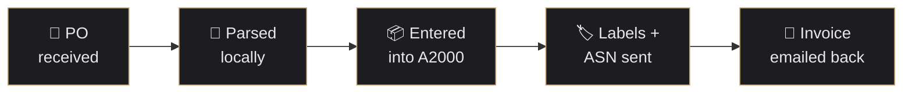
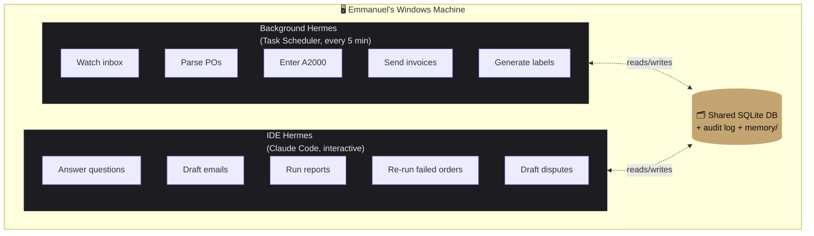

# Hermes — Demo Package

> Everything needed to show Hermes to a client when we can't run a true live demo against their infrastructure.

## Two deliverables

1. **[`DEMO.html`](DEMO.html)** — the primary visual. Self-contained one-page site. Open in any browser, full-screen, on the laptop in front of Emmanuel. Dark-themed, professional, tells the full story from problem → solution → math → trust → CTA. Works offline. Prints clean to PDF if we need a leave-behind.

2. **The mock terminal run** — `demo\demo.bat` on Windows (or `python -m demo.run_demo`). Backs up DEMO.html with an in-person live pipeline execution. Completes in ~0.1 seconds. Use this AFTER walking through DEMO.html to prove the code is real.

## How to show it

1. Laptop full-screen: `docs/DEMO.html` in Chrome
2. Scroll top-to-bottom with Emmanuel — narrate each section (full script in [`MEETING_PLAN.md`](MEETING_PLAN.md))
3. At the "Recorded demo output" section, switch to a terminal and run `demo.bat` live — mirrors the recorded output
4. Return to the HTML, keep scrolling through value math → trust → path forward

Total walkthrough: ~8 minutes if he doesn't interrupt, ~15 if he asks questions (good sign).

## Architecture diagram (Mermaid)

For markdown viewers (GitHub, Obsidian, Cursor) that render Mermaid natively.

## The 5-step pipeline (simplified flow)

## Two-layer deployment

## Demo narration script (cheat card)

See the full meeting plan at [`MEETING_PLAN.md`](MEETING_PLAN.md) — this is the condensed version to hold in hand during the walkthrough.

| Section in DEMO.html | 30-second line |
|---|---|
| **Hero** | "Built for Lowinger Distribution specifically. 215 tests passing. Pipeline runs in a tenth of a second." |
| **The problem (6:42 AM timeline)** | "This is the day we're taking off your plate. Every line here is a handoff Hermes takes." |
| **The loop (5 steps)** | "Email in. AI parses locally. Order into A2000. Labels print, ASN goes out. Invoice back. All automatic." |
| **Recorded demo output** | "This is the exact terminal output from this morning. PO parsed, invoice drafted — 0.14 seconds." |
| **How you talk to him** | "You type. Like texting a sharp new hire. No microphone, no new hardware." |
| **Value math** | "$50–150K in chargebacks — that's the floor, not the ceiling. Time savings is bonus." |
| **What's in the box** | "Right column is the control you keep. He drafts, you approve. Put on your plate, not take off it." |
| **CTA** | "14 days free, no credit card, removed clean if it doesn't earn its keep." |

## File pointers

- [`DEMO.html`](DEMO.html) — the visual package
- [`MEETING_PLAN.md`](MEETING_PLAN.md) — full meeting script + agenda + objection handling
- [`BUILD_PLAN.md`](BUILD_PLAN.md) — phase-by-phase roadmap (show if he asks "how soon can this go live")
- [`DISCOVERY_QUESTIONS.md`](DISCOVERY_QUESTIONS.md) — the 38 questions to send after the meeting
- [`WHOLESALE_RESEARCH.md`](WHOLESALE_RESEARCH.md) — backup citations for the chargeback math if pushed
